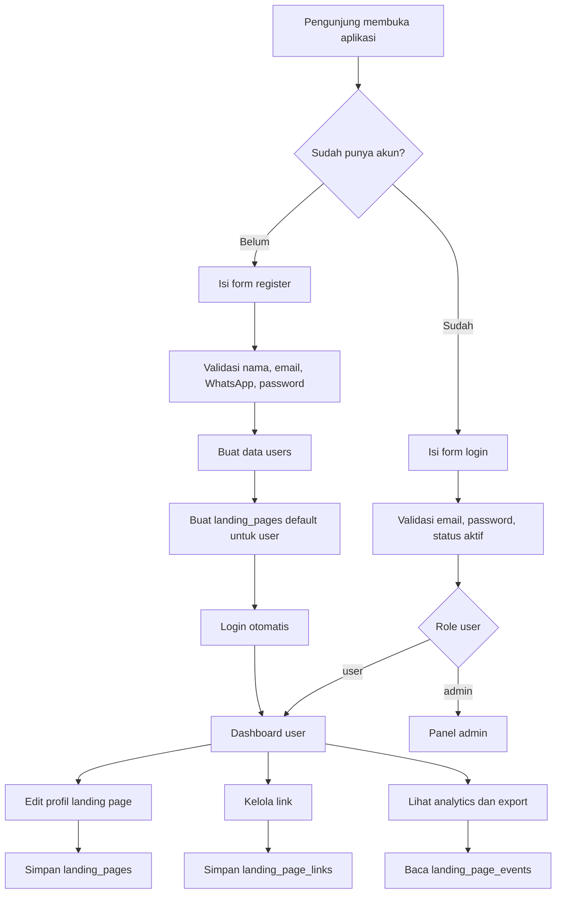
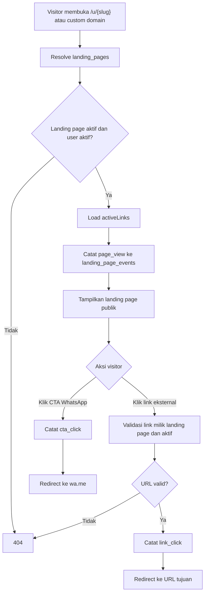
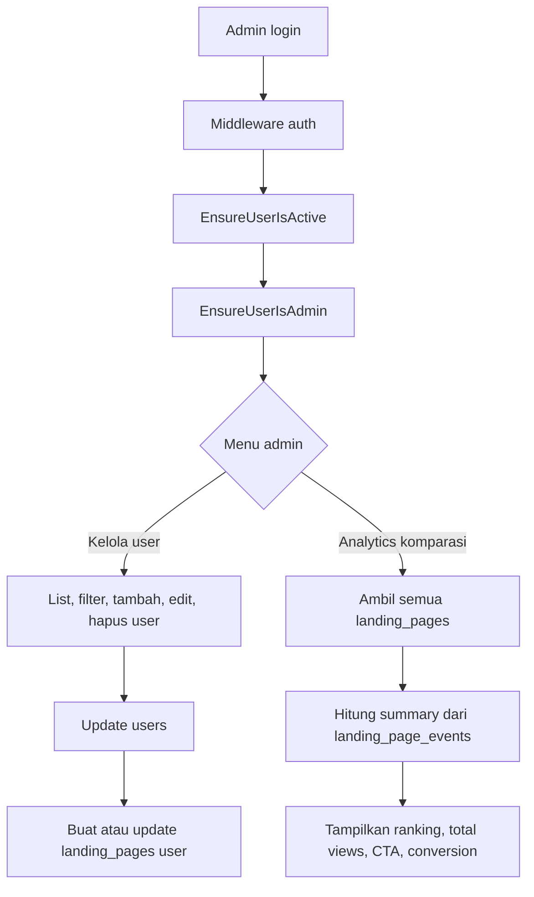
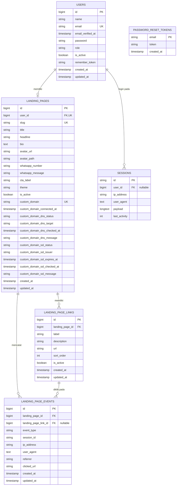

# Dokumentasi Diagram Aplikasi Landing Page

Dokumen ini merangkum diagram proses, ERD, dan kardinalitas berdasarkan route, controller, model, dan migration pada project Laravel ini.

## 1. Diagram Proses Utama

### 1.1 Registrasi, Login, dan Dashboard User

### 1.2 Proses Publik Landing Page dan Tracking

### 1.3 Proses Admin

## 2. ERD

## 3. Kardinalitas

| Relasi | Kardinalitas | Dasar implementasi | Catatan |
| --- | --- | --- | --- |
| `users` ke `landing_pages` | 1 : 0..1 | `landing_pages.user_id` adalah FK dan `unique` | Satu user maksimal memiliki satu landing page. Landing page wajib punya satu user. |
| `landing_pages` ke `landing_page_links` | 1 : 0..N | `landing_page_links.landing_page_id` FK | Satu landing page dapat memiliki banyak link. Link dihapus otomatis saat landing page dihapus. |
| `landing_pages` ke `landing_page_events` | 1 : 0..N | `landing_page_events.landing_page_id` FK | Semua event wajib terkait satu landing page. Event dihapus otomatis saat landing page dihapus. |
| `landing_page_links` ke `landing_page_events` | 1 : 0..N, event 0..1 link | `landing_page_events.landing_page_link_id` nullable FK | `page_view` dan `cta_click` tidak memakai link. `link_click` memakai link. Jika link dihapus, FK event menjadi `NULL`. |
| `users` ke `sessions` | 1 : 0..N, session 0..1 user | `sessions.user_id` nullable index | Session bisa milik user login atau guest. |
| `password_reset_tokens` ke `users` | Referensi logis via email | `password_reset_tokens.email` primary key | Tidak ada foreign key eksplisit ke `users.email`. |

## 4. Ringkasan Entitas

| Entitas | Fungsi |
| --- | --- |
| `users` | Menyimpan akun, role (`admin` atau `user`), dan status aktif. |
| `landing_pages` | Profil landing page milik user, termasuk slug, tema, WhatsApp, avatar, status aktif, dan custom domain. |
| `landing_page_links` | Daftar link eksternal yang tampil pada landing page publik. |
| `landing_page_events` | Log analytics untuk `page_view`, `cta_click`, dan `link_click`. |
| `sessions` | Penyimpanan session Laravel. |
| `password_reset_tokens` | Token reset password Laravel. |
